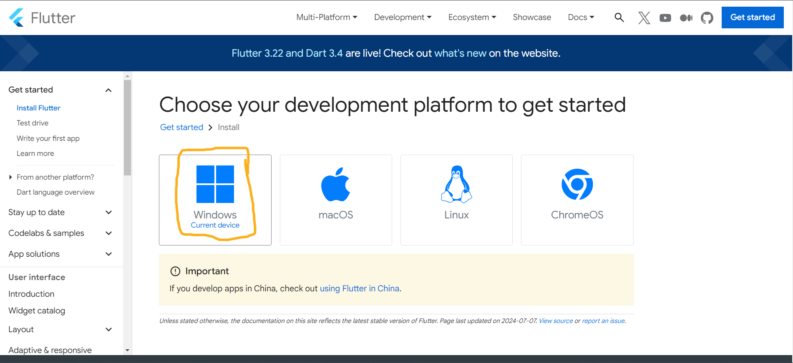
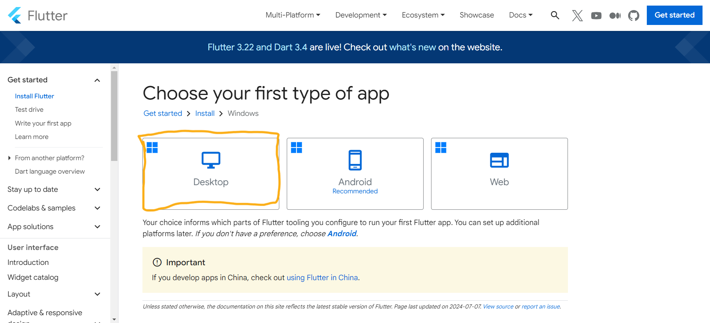
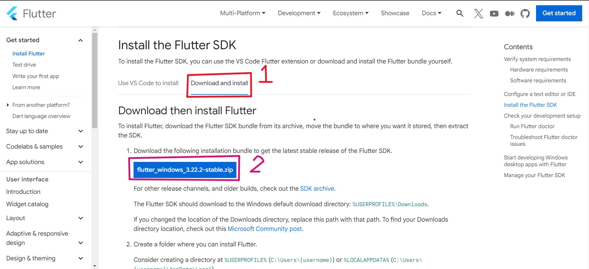
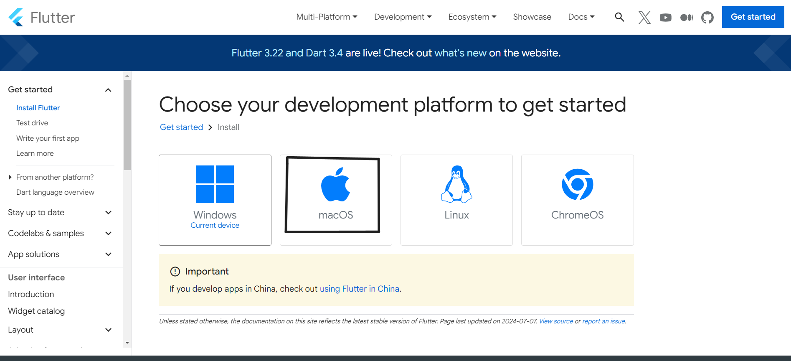
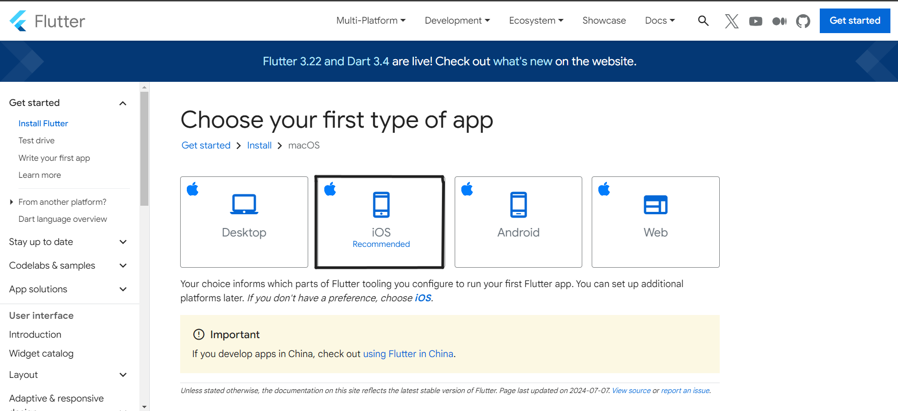
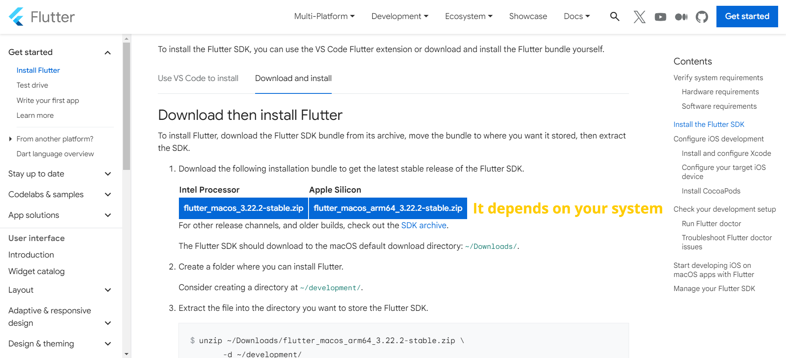

# Netflix Project

</img>

This Is Project For Flutter.

# How To Installing Flutter On Windows 🪟:

================================================================================================

================================================================================================

# How To Installing Flutter On MacOS 🍎🍏:

